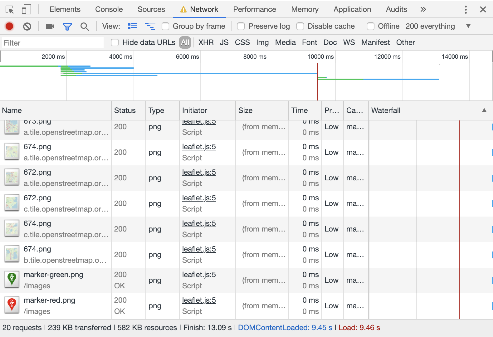
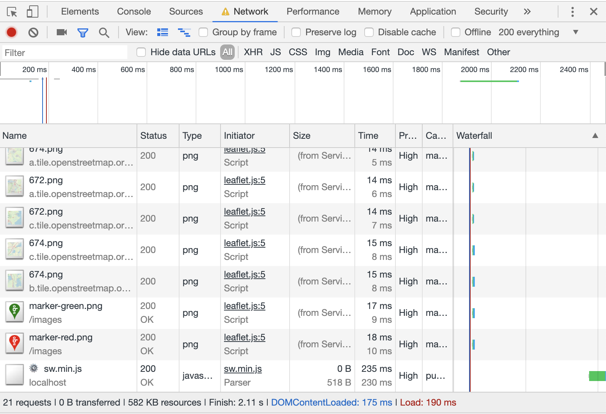

# Performance matters
> service-twerker.js

[Demo](https://performance-matters-jeroentvb.herokuapp.com/)

## Testresultaten
Voor de tests heb ik een gesimuleerde netwerksnelheid gebruikt van 200kb up/down.

----
Dit zijn de laadtijden voor het laden van alles. Dus ook na `DOMContentLoaded`.

| Pagina | Zonder aanpassingen | HTML minification & compression | Caching header | serviceWorker | Totaal bespaarde laadtijd |
| --- | --- | --- | --- | --- | --- |
| Home | 917ms | 682ms | 562ms | 2s | +1s |
| Resultaten | 20s | 19s | 2s | 3s | 17s |
| Detail | 14s | 8s | 3s | 3s | 11s |

---
Dit zijn de laadtijden tot `DOMContentLoaded`

| Pagina | Zonder aanpassingen | HTML minification & compression | Caching header | serviceWorker | Totaal bespaarde laadtijd |
| --- | --- | --- | --- | --- | --- |
| Home | 314ms | 309ms | 309ms | 113ms | 201ms |
| Resultaten | 3s | 1s | 1s | 653ms | 2.5s |
| Detail | 9s | 5s | 2s | 175ms | 8.8s |

### Before


### After


## Gebruikte performance enhancements
1. HTML Minification

```js
const minifyHTML = require('express-minify-html')

app()
  .use(minifyHTML({
    override: true,
    exception_url: false,
    htmlMinifier: {
      removeComments: true,
      collapseWhitespace: true,
      collapseBooleanAttributes: true,
      removeAttributeQuotes: true,
      removeEmptyAttributes: true,
      minifyJS: true
    }
  }))
```

2. GZip Compression

```js
const compression = require('compression')

app()
  .use(compression())
```

3. Caching Header

```js
app()
  .use((req, res, next) => {
    res.setHeader('Cache-Control', 'max-age=' + 30 * 24 * 60 * 60)
    next()
  })
```

4. NPM build tooling (minifying static assets)

```json
{
  "scripts": {
    "build:js": "terser static/js/script.js -c -m -o static/js/script.min.js && terser static/sw.js -c -m -o static/sw.min.js",
    "build:css": "postcss static/css/styles.css > static/css/styles.min.css",
    "build": "npm run build:js && npm run build:css"
  }
}
```

5. Service Worker

De service worker zelf staat in [sw.js](static/sw.js)

```js
if ('serviceWorker' in navigator) {
  navigator.serviceWorker.register('sw.min.js')
    .then(registration => {
      // registration worked
      console.log('Registration succeeded. Scope is ' + registration.scope)

      registration.update()
    })
    .catch(err => {
      // registration failed
      console.log('Registration failed with ' + err)
    })
}
```

## To do
- [ ] Image lazyloading toevoegen
- [ ] Image reflow voorkomen
- [ ] Statische assets precompressen
- [ ] Bundel JS voor de detail pagina
